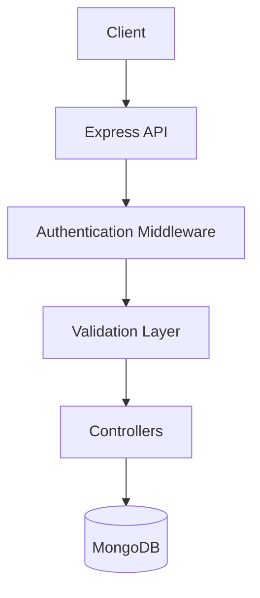
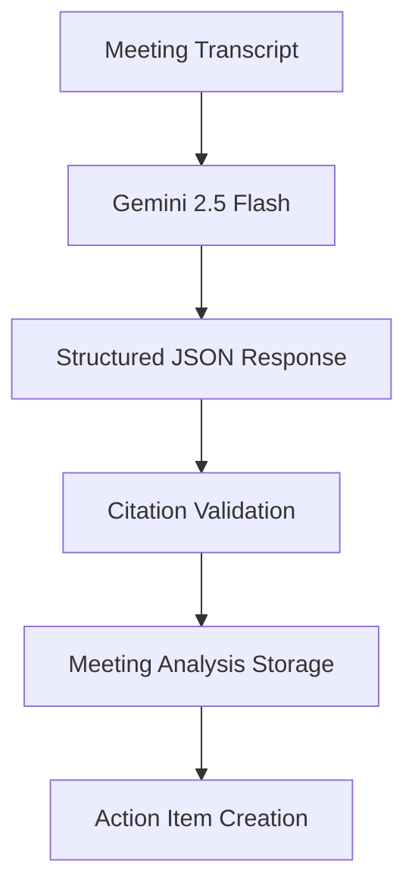
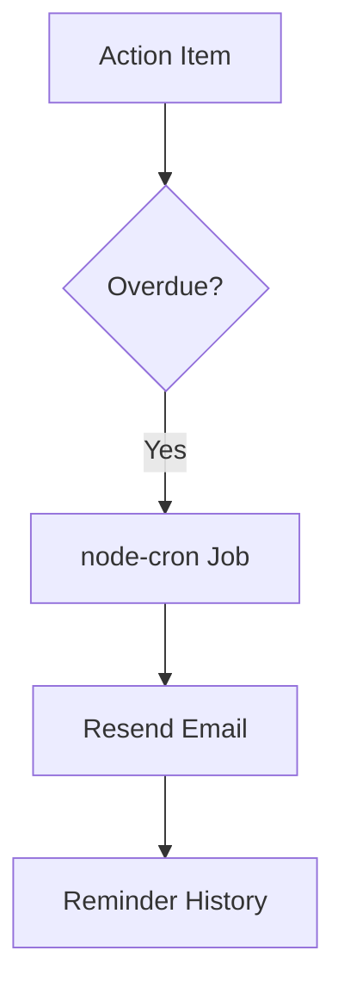

# Hintro Meeting Intelligence API

An AI-powered meeting intelligence platform that transforms raw meeting transcripts into structured insights, decisions, follow-ups, and actionable tasks with grounded citations.

## Overview

Hintro helps teams extract value from meeting conversations by automatically analyzing transcripts and generating:

- Executive summaries
- Key decisions
- Follow-up items
- Action items with assignees
- Grounded citations linked to transcript timestamps

The platform also includes action item management, overdue task tracking, automated email reminders, structured logging, traceability, and API documentation.

---

## Features

### Authentication

- JWT-based authentication using HTTP-only cookies
- Secure user registration and login
- Protected routes
- Session management via cookies

### Meeting Management

- Create meetings with participants and transcripts
- Retrieve individual meetings
- List meetings with pagination
- Delete meetings

### AI Meeting Analysis

- Analyze meeting transcripts using Gemini 2.5 Flash
- Generate:
  - Summary
  - Decisions
  - Follow-ups
  - Action items
- Persist analysis results in MongoDB

### Grounded Citations

Every AI-generated insight includes citations linked to transcript timestamps.

Example:

```json
{
   "text": "The team agreed to launch next Friday.",
   "citations": [
      {
         "timestamp": "00:10"
      }
   ]
}

```

Citations are validated against the original transcript before storage.

### Action Item Tracking

* Create action items manually
* Automatically extract action items from meeting analysis
* Update action item status
* Filter by status, assignee, or meeting
* Pagination support

### Overdue Detection

Identify incomplete action items whose due dates have passed.

### Automated Email Reminders

* Scheduled reminder processing using node-cron
* Email delivery via Resend
* Reminder history tracking
* Failure auditing

### API Documentation

Interactive Swagger UI documentation for all endpoints.

### Observability

* Structured logging using Winston
* Distributed request tracing with Trace IDs
* Centralized error handling
* Consistent API response format

---

## Tech Stack

### Backend

* Node.js
* Express.js

### Database

* MongoDB
* Mongoose

### AI

* Gemini 2.5 Flash

### Authentication

* JWT
* HTTP-only Cookies

### Validation

* Zod

### Email Service

* Resend

### Scheduling

* node-cron

### Documentation

* Swagger / OpenAPI 3.0

### Logging

* Winston

---

## Architecture

### System Components

* Express API — Handles authentication, meetings, action items, evaluation endpoints, and API documentation.
* MongoDB — Stores users, meetings, analyses, action items, and reminder history.
* Gemini 2.5 Flash — Generates structured meeting insights.
* Resend — Sends automated email reminders.
* node-cron — Executes scheduled reminder jobs.

### Request Flow



---

## AI Analysis Workflow



### Analysis Output

The AI extracts:

* Summary
* Decisions
* Follow-ups
* Action Items
* Grounded Citations

All citations are verified against transcript timestamps before persistence.

---

## Reminder Workflow



---

## API Response Format

### Success Response

```json
{
   "traceId": "uuid",
   "success": true,
   "data": {}
}

```

### Error Response

```json
{
   "traceId": "uuid",
   "success": false,
   "error": {
      "code": "VALIDATION_ERROR",
      "message": "Invalid meeting id"
   }
}

```

---

## Environment Variables

Create a .env file using the following variables:

```env
PORT=3000
MONGODB_URI=
JWT_SECRET=
GEMINI_API_KEY=
RESEND_API_KEY=
NODE_ENV=development

```

---

## Local Development

### Clone Repository

```bash
git clone [https://github.com/kavya-thakur/hintro.git](https://github.com/kavya-thakur/hintro.git)
cd hintro

```

### Install Dependencies

```bash
npm install

```

### Create Environment File

```bash
cp .env.example .env

```

### Start Development Server

```bash
npm run dev

```

### Start Production Server

```bash
npm start

```

---

## API Documentation

### Local

```text
http://localhost:3000/api-docs

```

### Production

```text
[https://hintro-0foh.onrender.com/api-docs](https://hintro-0foh.onrender.com/api-docs)

```

---

## Evaluation Endpoint

The project includes a dedicated evaluation endpoint containing implementation and architecture details.

### Endpoint

```http
GET /api/evaluation

```

### Production URL

```text
[https://hintro-0foh.onrender.com/api/evaluation](https://hintro-0foh.onrender.com/api/evaluation)

```

---

## Production Deployment

### Base URL

```text
[https://hintro-0foh.onrender.com](https://hintro-0foh.onrender.com)

```

### Health Check

```text
[https://hintro-0foh.onrender.com/health](https://hintro-0foh.onrender.com/health)

```

### Swagger Documentation

```text
[https://hintro-0foh.onrender.com/api-docs](https://hintro-0foh.onrender.com/api-docs)

```

---

## Project Structure

```text
hintro/
├── src/
│   ├── config/
│   ├── controllers/
│   ├── db/
│   ├── jobs/
│   ├── middlewares/
│   ├── models/
│   ├── routes/
│   ├── services/
│   ├── utils/
│   └── validators/
├── .env.example
├── server.js
├── package.json
└── README.md

```

---

## Key Engineering Decisions

### Why MongoDB?

Meeting transcripts, AI outputs, citations, and action items contain nested structures that naturally fit a document database.

### Why JWT Cookies?

HTTP-only cookies provide a secure authentication mechanism while preventing direct JavaScript access to tokens.

### Why Gemini 2.5 Flash?

Gemini Flash provides fast inference, structured JSON generation, and cost-efficient transcript analysis.

### Why Citation Validation?

AI-generated insights are accepted only when citations reference valid transcript timestamps, reducing hallucinations and improving trustworthiness.

### Why Resend?

Resend provides a simple developer experience and reliable transactional email delivery.

### Why node-cron?

node-cron enables lightweight background scheduling without requiring additional infrastructure.

---

## API Capabilities

### Authentication

* Register User
* Login User
* Logout User

### Meetings

* Create Meeting
* Get Meeting
* Get Meetings
* Delete Meeting
* Analyze Meeting

### Action Items

* Create Action Item
* Get Action Items
* Update Action Item Status
* Get Overdue Action Items

### System

* Health Check
* Evaluation Endpoint
* Swagger Documentation

---

## Author

Kavya

AI-powered backend system for meeting intelligence, grounded insights, action item extraction, and automated follow-up management.

```

```
